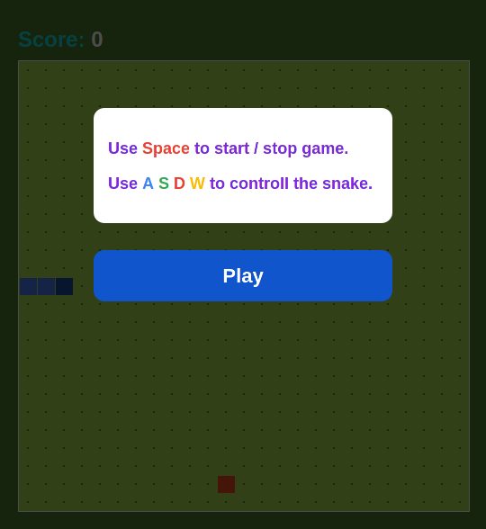
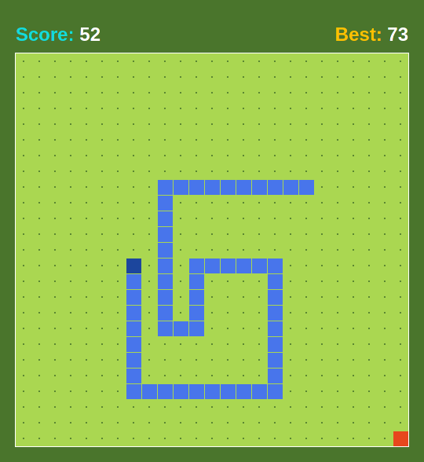
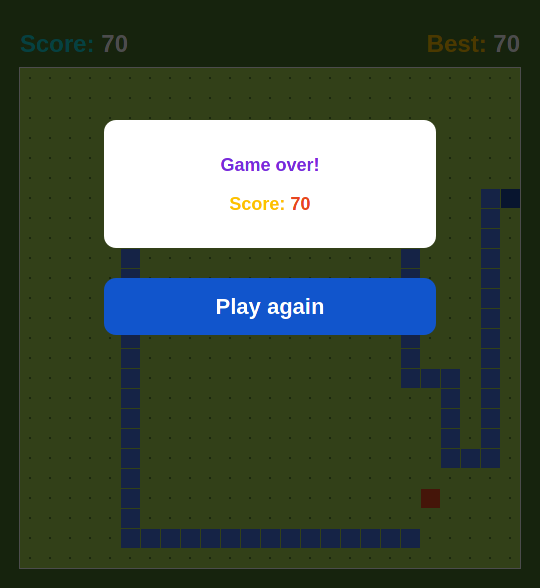

## Snake game (implementation in Typescript)
--------------------------------------------------------------------------------

### Few screenshots





### How to run?

1) Download the source code and all the assets into a folder
2) Open the index.html file on a browser
3) Enjoy :)

### Build game from source code

Your should have `nodejs` and `npm` on your computer. Go to `/path/to/repository/Typescript` and run:
```bash
npm i
npm run build
```
Follow steps from **How to run?** sections.

### Your contributions are welcome

Run snake game in development mode:
```bash
npm i
npm run serve
```

### To do

 - Add settings
    - Change snake speed
    - Select theme
    - Transparent walls
